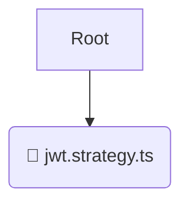

# 🏢 infrastructure

*Breadcrumbs:* [backend](/backend) / [src](/backend/src) / [modules](/backend/src/modules) / [auth](/backend/src/modules/auth) / [infrastructure](/backend/src/modules/auth/infrastructure)

## 🎯 PURPOSE
This directory `infrastructure` is an integral part of the Mavluda Beauty ecosystem. It handles external integrations, databases, and low-level infrastructural concerns.
This directory is meticulously maintained to uphold the 'Luxury Professional' standards of the Mavluda Beauty brand.

## 🏗️ ARCHITECTURE


## 📄 FILE REGISTRY
| File Name | Type | Responsibility | Key Aliases Used |
|---|---|---|---|
| `jwt.strategy.ts` | `ts` | Core functionality | `@nestjs/common, @common/config/app-config.service, @nestjs/passport` |

## 🔗 DEPENDENCIES
- `@nestjs/common`
- `@common/config/app-config.service`
- `@nestjs/passport`

## 🛠️ USAGE
```typescript
// Example placeholder for interacting with the infrastructure module
import { example } from './jwt.strategy.ts';
```
