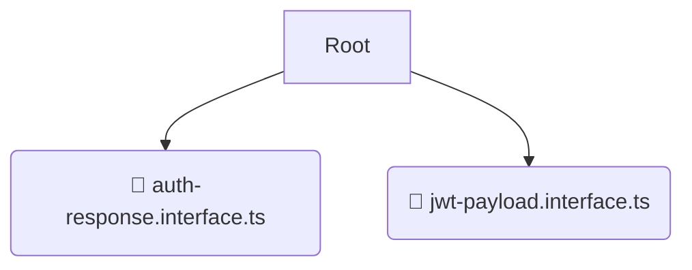

# 📝 interfaces

*Breadcrumbs:* [backend](/backend) / [src](/backend/src) / [modules](/backend/src/modules) / [auth](/backend/src/modules/auth) / [interfaces](/backend/src/modules/auth/interfaces)

## 🎯 PURPOSE
This directory `interfaces` is an integral part of the Mavluda Beauty ecosystem. It supports the scalable NestJS backend architecture.
This directory is meticulously maintained to uphold the 'Luxury Professional' standards of the Mavluda Beauty brand.

## 🏗️ ARCHITECTURE


## 📄 FILE REGISTRY
| File Name | Type | Responsibility | Key Aliases Used |
|---|---|---|---|
| `auth-response.interface.ts` | `ts` | Core functionality | `@modules/user` |
| `jwt-payload.interface.ts` | `ts` | Core functionality | `None` |

## 🔗 DEPENDENCIES
- `@modules/user`

## 🛠️ USAGE
```typescript
// Example placeholder for interacting with the interfaces module
import { example } from './auth-response.interface.ts';
```
