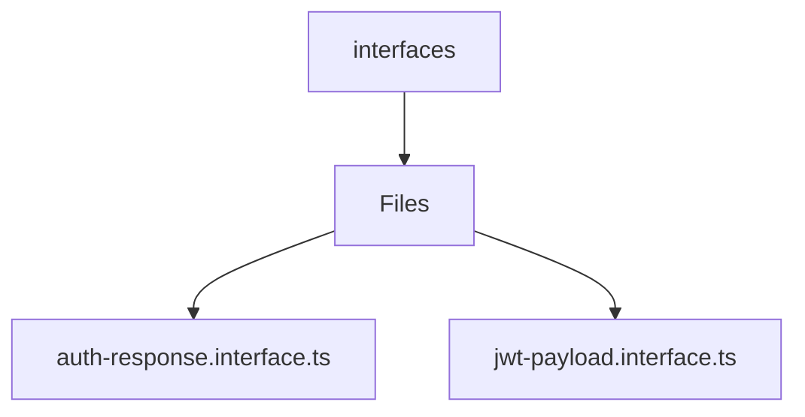

# 🏷️ Interfaces Directory

> *Elegance, Precision, and Luxury Professionalism — The Mavluda Beauty Standard.*

## 🧭 Breadcrumb Navigation
[backend](/backend) ➔ [src](/backend/src) ➔ [modules](/backend/src/modules) ➔ [auth](/backend/src/modules/auth) ➔ [interfaces](/backend/src/modules/auth/interfaces)

## 🎯 Purpose
This directory encapsulates the essential architecture and logic for the **Interfaces** domain within the Mavluda Beauty ecosystem. It serves as a foundational component ensuring robust, scalable, and elegant operations.

## 🏗️ Architecture


## 📄 File Registry
| File Name | Type | Responsibility | Key Aliases Used |
|---|---|---|---|
| `auth-response.interface.ts` | TypeScript | Exports: AuthResponse, TelegramAuthResponse | @modules |
| `jwt-payload.interface.ts` | TypeScript | Exports: JwtPayload | None |

## 🔗 Dependencies
- `@modules/user`

## 🛠️ Usage
```typescript
// To utilize the luxurious capabilities of this module:
import { AuthResponse } from './path/to/authresponse';

// Ensure properly typed interactions per Mavluda Beauty standards
```
