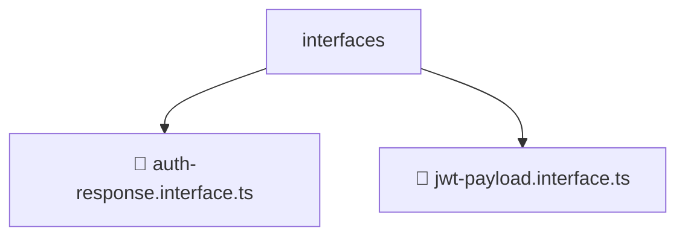

# 📂 INTERFACES

> 💎 **Mavluda Beauty - Luxury Professional Architecture**

### 📍 Breadcrumb Navigation
`. > backend > src > modules > auth > interfaces`

## 🎯 PURPOSE
This directory encapsulates `Module Root` level functionality within the Mavluda Beauty ecosystem, ensuring proper separation of concerns and architectural transparency.

**FSD / Architecture Layer:** `Module Root`

## 🏗️ ARCHITECTURE


## 📄 FILE REGISTRY

| Item Name | Type | Responsibility | Key Aliases Used |
|-----------|------|----------------|------------------|
| `📄 auth-response.interface.ts` | `.ts` | General functionality | `@modules/user` |
| `📄 jwt-payload.interface.ts` | `.ts` | General functionality | `None` |

## 🔗 DEPENDENCIES
- `@modules/user`

## 🛠️ USAGE
```typescript
// Example usage context
import { ... } from './auth-response.interface';

// Integrate auth-response.interface logic into your feature.
```
