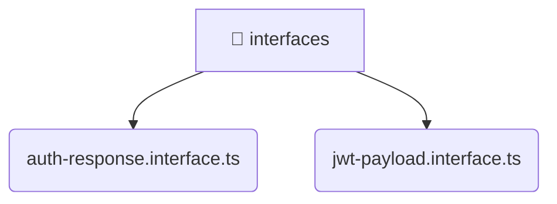

# [root](/) / [backend](/backend) / [src](/backend/src) / [modules](/backend/src/modules) / [auth](/backend/src/modules/auth) / [interfaces](/backend/src/modules/auth/interfaces)

## 🏷️ 📁 Interfaces

### 🎯 PURPOSE
The `interfaces` directory forms a critical foundation within the Mavluda Beauty ecosystem, meticulously orchestrating the interfaces logic to ensure a seamless and premium experience.

### 🏗️ ARCHITECTURE


### 📄 FILE REGISTRY
| File Name | Type | Responsibility | Key Aliases Used |
|---|---|---|---|
| `auth-response.interface.ts` | `ts` | Core logic implementation. | @modules |
| `jwt-payload.interface.ts` | `ts` | Core logic implementation. | None |

### 🔗 DEPENDENCIES
- `@modules/user`

### 🛠️ USAGE
```typescript
// Seamlessly integrate interfaces into your refined workflows:
import { /* exported members */ } from '@path/to/interfaces';
```
