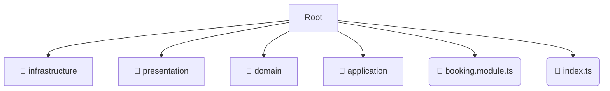

# 📂 booking

*Breadcrumbs:* [backend](/backend) / [src](/backend/src) / [modules](/backend/src/modules) / [booking](/backend/src/modules/booking)

## 🎯 PURPOSE
This directory `booking` is an integral part of the Mavluda Beauty ecosystem. It supports the scalable NestJS backend architecture.
This directory is meticulously maintained to uphold the 'Luxury Professional' standards of the Mavluda Beauty brand.

## 🏗️ ARCHITECTURE


## 📄 FILE REGISTRY
| File Name | Type | Responsibility | Key Aliases Used |
|---|---|---|---|
| `booking.module.ts` | `ts` | Module configuration | `@nestjs/mongoose, @nestjs/common` |
| `index.ts` | `ts` | Core functionality | `None` |

## 🔗 DEPENDENCIES
- `@nestjs/mongoose`
- `@nestjs/common`

## 🛠️ USAGE
```typescript
// Example placeholder for interacting with the booking module
import { example } from './booking.module.ts';
```
