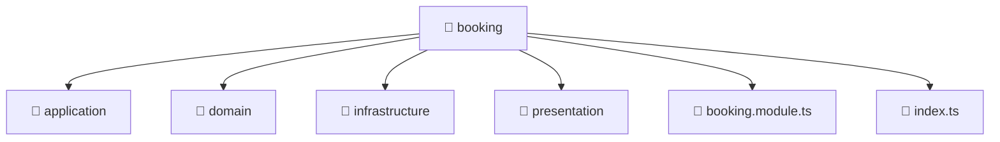

# 📁 Mavluda Beauty booking

[backend](/backend) / [src](/backend/src) / [modules](/backend/src/modules) / [booking](/backend/src/modules/booking)

## 🎯 Purpose
Delivering luxury-tier architectural components and high-performance logic for the **booking** domain. This directory is a crucial part of the Mavluda Beauty full-stack ecosystem, ensuring seamless scalability, robust performance, and an elite digital experience.

## 🏗️ Architecture


## 📄 File Registry
| File Name | Type | Responsibility | Key Aliases Used |
|---|---|---|---|
| `booking.module.ts` | Module | Groups related capabilities and defines dependencies. | `@nestjs/common, @nestjs/mongoose` |
| `index.ts` | TypeScript Logic | Core logic and utilities for this domain. | N/A |


## 🔗 Dependencies
**Path Aliases:**
- `@nestjs/common`
- `@nestjs/mongoose`


## 🛠️ Usage
```typescript
// Example integration for booking
// Import capabilities from this directory to enrich your modules.
```
> This directory provides specialized logic tailored to the Mavluda Beauty standard.
