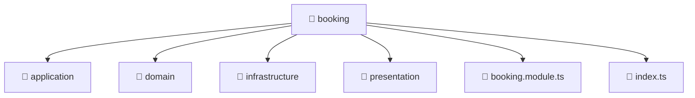

[Root](/.) > [backend](/backend) > [src](/backend/src) > [modules](/backend/src/modules) > [booking](/backend/src/modules/booking)

# 📁 Booking

## 🎯 Purpose
Delivering luxury-tier architectural components and high-performance logic for the **booking** domain. This directory is a crucial part of the Mavluda Beauty full-stack ecosystem, ensuring seamless scalability, robust performance, and an elite digital experience.

## 🏗️ Architecture


## 📄 File Registry
| File Name | Type | Responsibility | Key Aliases Used |
|---|---|---|---|
| `booking.module.ts` | TypeScript | Defines the architectural module boundaries for booking.module.ts. | @nestjs |
| `index.ts` | TypeScript | Provides core logic and orchestration for index.ts. | N/A |

## 🔗 Dependencies
- `./application/booking.service`, `./booking.module`, `./domain/booking.entity`, `./infrastructure/repositories/booking.repository`, `./infrastructure/schemas/booking.schema`, `./presentation/booking.controller`, `./presentation/dto/create-booking.dto`, `./presentation/dto/update-booking.dto`, `@nestjs/common`, `@nestjs/mongoose`

## 🛠️ Usage
```typescript
// Example usage within the Mavluda Beauty ecosystem
import { relevantMember } from './core';

// Integrate into the application architecture
relevantMember.execute();
```