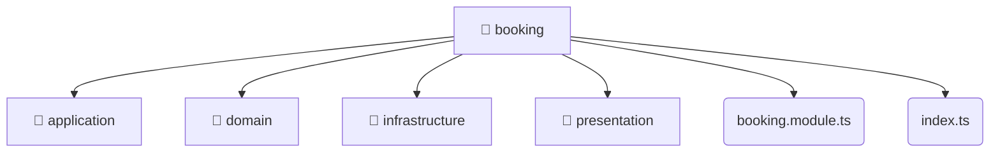

# [root](/) / [backend](/backend) / [src](/backend/src) / [modules](/backend/src/modules) / [booking](/backend/src/modules/booking)

## 🏷️ 📁 Booking

### 🎯 PURPOSE
The `booking` directory forms a critical foundation within the Mavluda Beauty ecosystem, meticulously orchestrating the booking logic to ensure a seamless and premium experience.

### 🏗️ ARCHITECTURE


### 📄 FILE REGISTRY
| File Name | Type | Responsibility | Key Aliases Used |
|---|---|---|---|
| `booking.module.ts` | `ts` | Module configuration and provider registration. | @nestjs |
| `index.ts` | `ts` | Core logic implementation. | None |

### 🔗 DEPENDENCIES
- `./application/booking.service`
- `./booking.module`
- `./domain/booking.entity`
- `./infrastructure/repositories/booking.repository`
- `./infrastructure/schemas/booking.schema`
- `./presentation/booking.controller`
- `./presentation/dto/create-booking.dto`
- `./presentation/dto/update-booking.dto`
- `@nestjs/common`
- `@nestjs/mongoose`

### 🛠️ USAGE
```typescript
// Seamlessly integrate booking into your refined workflows:
import { /* exported members */ } from '@path/to/booking';
```
