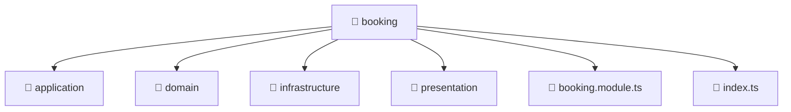

# 📁 Booking

[Root](/.) > [backend](/backend) > [src](/backend/src) > [modules](/backend/src/modules) > [booking](/backend/src/modules/booking)

## 🎯 Purpose
Delivering luxury-tier architectural components and high-performance logic for the **booking** domain. This directory is a crucial part of the Mavluda Beauty full-stack ecosystem, ensuring seamless scalability, robust performance, and an elite digital experience.

## 🏗️ Architecture


## 📄 File Registry
| File Name | Type | Responsibility | Key Aliases Used |
|---|---|---|---|
| `booking.module.ts` | TypeScript/JavaScript | Defines the architectural module boundaries for booking.module.ts. | @nestjs |
| `index.ts` | TypeScript/JavaScript | Provides core logic and orchestration for index.ts. | N/A |

## 🔗 Dependencies
- `@nestjs/common`
- `@nestjs/mongoose`

## 🛠️ Usage
```typescript
// Example usage within the Mavluda Beauty ecosystem
import { relevantMember } from './booking';

// Integrate into the application architecture
relevantMember.execute();
```
