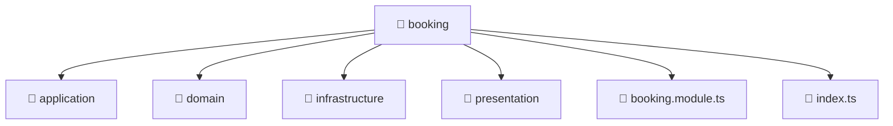

# 📁 booking

[Root](/.) > [backend](/backend) > [src](/backend/src) > [modules](/backend/src/modules) > [booking](/backend/src/modules/booking)

## 🎯 Purpose
Backend module defining application routes, business logic, and data access for the domain.

## 🏗️ Architecture


## 📄 File Registry
| File Name | Type | Responsibility | Key Aliases Used |
|---|---|---|---|
| `booking.module.ts` | TypeScript | Defines the architectural module boundaries for booking.module.ts. | @nestjs |
| `index.ts` | TypeScript | Provides core logic and orchestration for index.ts. | N/A |

## 🔗 Dependencies
- `./application/booking.service`
- `./infrastructure/repositories/booking.repository`
- `./presentation/booking.controller`
- `@nestjs/common`
- `@nestjs/mongoose`

## 🛠️ Usage
```typescript
import { Module } from '@nestjs/common';
// Import specific services/controllers provided by this module
```
