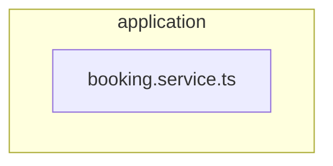

# ⚙️ application

[backend](../../../../README.md) > [src](../../../README.md) > [modules](../../README.md) > [booking](../README.md) > [application](README.md)

---

### 🎯 PURPOSE
Elevating the digital experience for the Mavluda Beauty ecosystem, this module manages the sophisticated Application Layer (Use cases and orchestration) operations.

*FSD Layer:* **Application Layer (Use cases and orchestration)**

---

### 🏗️ ARCHITECTURE



---

### 📄 FILE REGISTRY
| File Name | Type | Responsibility | Key Aliases Used |
|-----------|------|----------------|------------------|
| `booking.service.ts` | Service | Handles service logic for Mavluda Beauty's luxury standards. | `@nestjs` |

---

### 🔗 DEPENDENCIES
**Key Path Aliases Detected:** `@nestjs`

Notable imports:
- `../presentation/dto/create-booking.dto`
- `../infrastructure/repositories/booking.repository`
- `@nestjs/common`
- `../presentation/dto/update-booking.dto`
- `../domain/booking.entity`

---

### 🛠️ USAGE
To interact with this directory's luxurious logic, integrate its exported components or services directly into your feature modules. Ensure strict adherence to the Application Layer (Use cases and orchestration) boundaries.

```typescript
// Example integration snippet
import { FeatureModule } from '@path/to/application';
```
