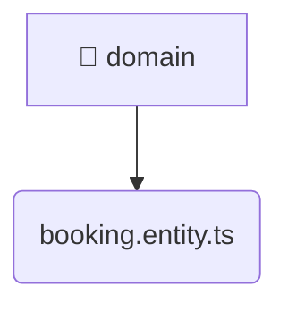

# [root](/) / [backend](/backend) / [src](/backend/src) / [modules](/backend/src/modules) / [booking](/backend/src/modules/booking) / [domain](/backend/src/modules/booking/domain)

## 🏷️ 📁 Domain

### 🎯 PURPOSE
The `domain` directory forms a critical foundation within the Mavluda Beauty ecosystem, meticulously orchestrating the domain logic to ensure a seamless and premium experience.

### 🏗️ ARCHITECTURE


### 📄 FILE REGISTRY
| File Name | Type | Responsibility | Key Aliases Used |
|---|---|---|---|
| `booking.entity.ts` | `ts` | Core logic implementation. | None |

### 🔗 DEPENDENCIES
- *Self-contained premium module.*

### 🛠️ USAGE
```typescript
// Seamlessly integrate domain into your refined workflows:
import { /* exported members */ } from '@path/to/domain';
```
