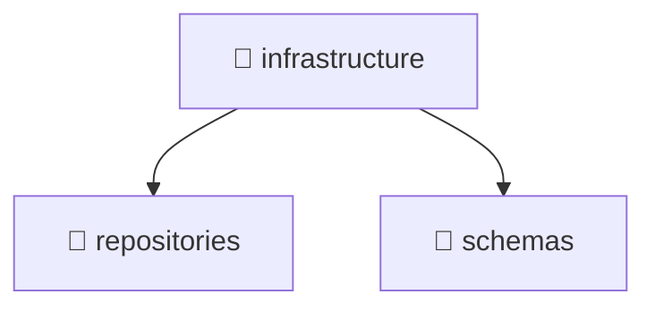

<!--
Mavluda Beauty - Luxury Professional Documentation
Generated for 100% Architectural Transparency
-->
[Home](../../../../../README.md) > [backend](../../../../README.md) > [src](../../../README.md) > [modules](../../README.md) > [booking](../README.md) > [infrastructure](./README.md)

# 📁 INFRASTRUCTURE Directory

## 🎯 PURPOSE
Provides implementations for external concerns like databases, repositories, and third-party integrations.

## 🏗️ ARCHITECTURE


## 📄 FILE REGISTRY
| File Name | Type | Responsibility | Key Aliases Used |
|---|---|---|---|
| (No files) | - | - | - |


## 🔗 DEPENDENCIES
- No external or internal imports detected in this directory.

## 🛠️ USAGE
```typescript
// Example placeholder for interacting with infrastructure
// Consult the individual files in the registry for specific APIs.
```
