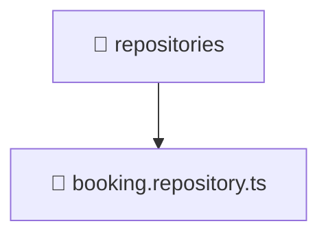

# 📁 repositories

[Root](/.) > [backend](/backend) > [src](/backend/src) > [modules](/backend/src/modules) > [booking](/backend/src/modules/booking) > [infrastructure](/backend/src/modules/booking/infrastructure) > [repositories](/backend/src/modules/booking/infrastructure/repositories)

## 🎯 Purpose
Delivering luxury-tier architectural components and high-performance logic for the **repositories** domain. This directory is a crucial part of the Mavluda Beauty full-stack ecosystem, ensuring seamless scalability, robust performance, and an elite digital experience.

## 🏗️ Architecture


## 📄 File Registry
| File Name | Type | Responsibility | Key Aliases Used |
|---|---|---|---|
| `booking.repository.ts` | TypeScript | Handles logic and definitions for booking.repository.ts | @nestjs/common, @nestjs/mongoose |

## 🔗 Dependencies
- `../../domain/booking.entity`
- `@nestjs/common`
- `@nestjs/mongoose`
- `mongoose`

## 🛠️ Usage
```typescript
// Example usage within the Mavluda Beauty ecosystem
import { relevantMember } from './repositories';

// Integrate into the application architecture
relevantMember.execute();
```
