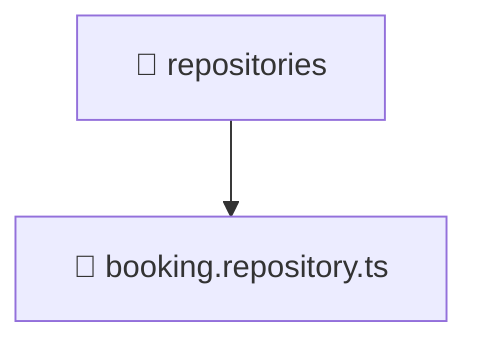

# 📁 repositories

[Root](/../../../../../../README.md) / [backend](../../../../../README.md) / [src](../../../../README.md) / [modules](../../../README.md) / [booking](../../README.md) / [infrastructure](../README.md) / [repositories](./README.md)

## 🎯 Purpose
Delivering luxury-tier architectural components and high-performance logic for the **repositories** domain. This directory is a crucial part of the Mavluda Beauty full-stack ecosystem, ensuring seamless scalability, robust performance, and an elite digital experience.

## 🏗️ Architecture


## 📄 File Registry
| File Name | Type | Responsibility | Key Aliases Used |
|---|---|---|---|
| `booking.repository.ts` | TypeScript | Provides core logic and orchestration for booking.repository.ts. | @nestjs |


## 🔗 Dependencies
**Internal / Aliases:**
- `../../domain/booking.entity`
- `@nestjs/common`
- `@nestjs/mongoose`

**External:**
- `mongoose`


## 🛠️ Usage
```typescript
// Example usage within the Mavluda Beauty ecosystem
import { relevantMember } from './booking.repository';

// Integrate into the application architecture
relevantMember.execute();
```
