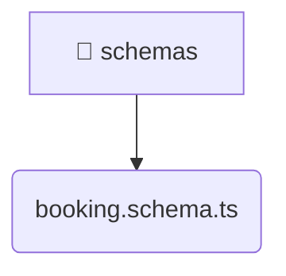

# [root](/) / [backend](/backend) / [src](/backend/src) / [modules](/backend/src/modules) / [booking](/backend/src/modules/booking) / [infrastructure](/backend/src/modules/booking/infrastructure) / [schemas](/backend/src/modules/booking/infrastructure/schemas)

## 🏷️ 📁 Schemas

### 🎯 PURPOSE
The `schemas` backend module encapsulates the business logic, presentation, and data access for schemas.

### 🏗️ ARCHITECTURE


### 📄 FILE REGISTRY
| File Name | Type | Responsibility | Key Aliases Used |
|---|---|---|---|
| `booking.schema.ts` | `ts` | Core logic implementation. | @nestjs |

### 🔗 DEPENDENCIES
- `@nestjs/mongoose`
- `mongoose`

### 🛠️ USAGE
```typescript
// Seamlessly integrate schemas into your refined workflows:
import { /* exported members */ } from '@path/to/schemas';
```
