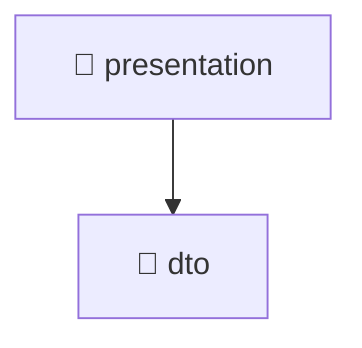

# 📁 presentation

[Root](/.) > [backend](/backend) > [src](/backend/src) > [modules](/backend/src/modules) > [booking](/backend/src/modules/booking) > [presentation](/backend/src/modules/booking/presentation)

## 🎯 Purpose
Delivering luxury-tier architectural components and high-performance logic for the **presentation** domain. This directory is a crucial part of the Mavluda Beauty full-stack ecosystem, ensuring seamless scalability, robust performance, and an elite digital experience.
> **FSD Layer:** Modules (Backend FSD) - Adhering to strict Feature Sliced Design architectural constraints.

## 🏗️ Architecture


## 📄 File Registry
| File Name | Type | Responsibility | Key Aliases Used |
|---|---|---|---|
| `booking.controller.ts` | Controller | Request handling and routing. | @nestjs |


## 🔗 Dependencies
- `@nestjs/common`
- `../application/booking.service`
- `./dto/create-booking.dto`
- `./dto/update-booking.dto`

## 🛠️ Usage
```typescript
// Example usage within the Mavluda Beauty ecosystem
import { relevantMember } from './booking.controller';

// Integrate into the application architecture
relevantMember.execute();
```
