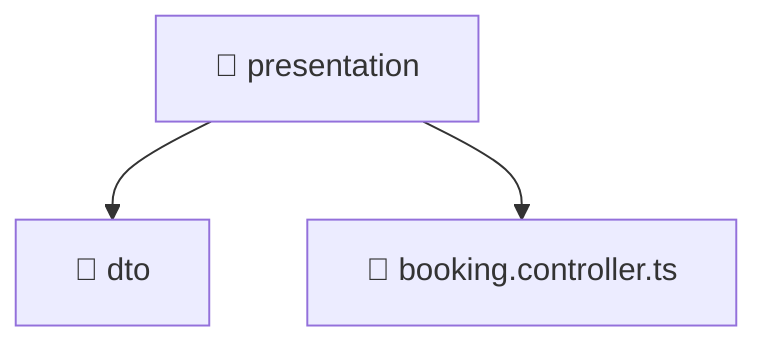

<!--
Mavluda Beauty - Luxury Professional Documentation
Generated for 100% Architectural Transparency
-->
[Home](../../../../../README.md) > [backend](../../../../README.md) > [src](../../../README.md) > [modules](../../README.md) > [booking](../README.md) > [presentation](./README.md)

# 📁 PRESENTATION Directory

## 🎯 PURPOSE
Handles incoming HTTP requests, controllers, and data transfer objects (DTOs).

## 🏗️ ARCHITECTURE


## 📄 FILE REGISTRY
| File Name | Type | Responsibility | Key Aliases Used |
|---|---|---|---|
| `booking.controller.ts` | TypeScript | Request routing and response handling. | - |


## 🔗 DEPENDENCIES
- `../application/booking.service`
- `./dto/create-booking.dto`
- `./dto/update-booking.dto`

## 🛠️ USAGE
```typescript
// Example placeholder for interacting with presentation
// Consult the individual files in the registry for specific APIs.
```
