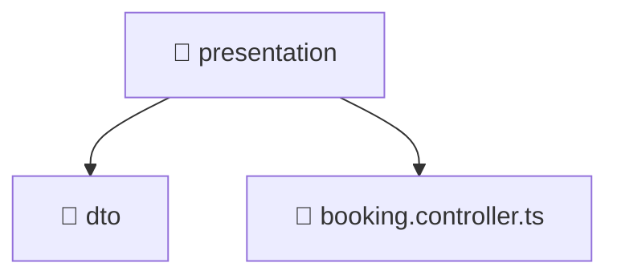

# 📁 presentation

[Root](/.) > [backend](/backend) > [src](/backend/src) > [modules](/backend/src/modules) > [booking](/backend/src/modules/booking) > [presentation](/backend/src/modules/booking/presentation)

## 🎯 Purpose
Backend module defining application routes, business logic, and data access for the domain.

## 🏗️ Architecture


## 📄 File Registry
| File Name | Type | Responsibility | Key Aliases Used |
|---|---|---|---|
| `booking.controller.ts` | TypeScript | Handles incoming HTTP requests and routing for booking.controller.ts. | N/A |

## 🔗 Dependencies
- `../application/booking.service`
- `./dto/create-booking.dto`
- `./dto/update-booking.dto`

## 🛠️ Usage
```typescript
import { Module } from '@nestjs/common';
// Import specific services/controllers provided by this module
```
