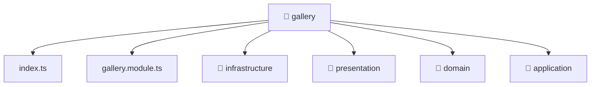

[🏠 Home](../../../../README.md) > [backend](../../../README.md) > [src](../../README.md) > [modules](../README.md) > [gallery](./README.md)

# 📁 gallery

### 🎯 PURPOSE
Welcome to the exquisite **gallery** module of the Mavluda Beauty ecosystem. This directory handles specific domain assets and logic. It is designed adhering to our 'Luxury Professional' standards.

### 🏗️ ARCHITECTURE


### 📄 FILE REGISTRY
| File Name | Type | Responsibility | Key Aliases Used |
|---|---|---|---|
| `gallery.module.ts` | Angular Module | Configures an application module or layer Defines classes: GalleryModule. | @nestjs |
| `index.ts` | TypeScript File | Exports or orchestrates module members. | None |

### 🔗 DEPENDENCIES
- `@nestjs/common`
- `@nestjs/mongoose`

### 🛠️ USAGE
```typescript
// Example interaction or integration snippet
// Import members from gallery based on module boundaries
```
