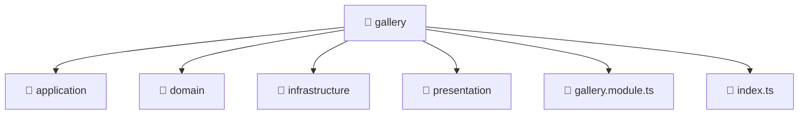

# 📁 gallery

[Root](/../../../../README.md) / [backend](../../../README.md) / [src](../../README.md) / [modules](../README.md) / [gallery](./README.md)

## 🎯 Purpose
Delivering luxury-tier architectural components and high-performance logic for the **gallery** domain. This directory is a crucial part of the Mavluda Beauty full-stack ecosystem, ensuring seamless scalability, robust performance, and an elite digital experience.

## 🏗️ Architecture


## 📄 File Registry
| File Name | Type | Responsibility | Key Aliases Used |
|---|---|---|---|
| `gallery.module.ts` | Module | Defines the architectural module boundaries for gallery.module.ts. | @nestjs |
| `index.ts` | TypeScript | Provides core logic and orchestration for index.ts. | N/A |


## 🔗 Dependencies
**Internal / Aliases:**
- `./application/gallery.service`
- `./infrastructure/repositories/gallery.repository`
- `./presentation/gallery.controller`
- `@nestjs/common`
- `@nestjs/mongoose`


## 🛠️ Usage
```typescript
// Example usage within the Mavluda Beauty ecosystem
import { relevantMember } from './gallery.module';

// Integrate into the application architecture
relevantMember.execute();
```
