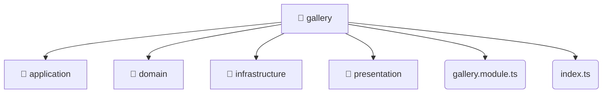

# [root](/) / [backend](/backend) / [src](/backend/src) / [modules](/backend/src/modules) / [gallery](/backend/src/modules/gallery)

## 🏷️ 📁 Gallery

### 🎯 PURPOSE
The `gallery` backend module encapsulates the business logic, presentation, and data access for gallery.

### 🏗️ ARCHITECTURE


### 📄 FILE REGISTRY
| File Name | Type | Responsibility | Key Aliases Used |
|---|---|---|---|
| `gallery.module.ts` | `ts` | Module configuration and provider registration. | @nestjs |
| `index.ts` | `ts` | Core logic implementation. | None |

### 🔗 DEPENDENCIES
- `./application/gallery.service`
- `./domain/gallery.entity`
- `./gallery.module`
- `./infrastructure/repositories/gallery.repository`
- `./infrastructure/schemas/gallery.schema`
- `./presentation/dto/create-gallery.dto`
- `./presentation/dto/update-gallery.dto`
- `./presentation/gallery.controller`
- `@nestjs/common`
- `@nestjs/mongoose`

### 🛠️ USAGE
```typescript
// Seamlessly integrate gallery into your refined workflows:
import { /* exported members */ } from '@path/to/gallery';
```
