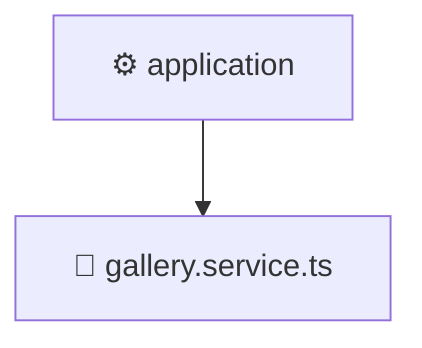

# ⚙️ Mavluda Beauty application

[backend](/backend) / [src](/backend/src) / [modules](/backend/src/modules) / [gallery](/backend/src/modules/gallery) / [application](/backend/src/modules/gallery/application)

## 🎯 Purpose
Delivering luxury-tier architectural components and high-performance logic for the **application** domain. This directory is a crucial part of the Mavluda Beauty full-stack ecosystem, ensuring seamless scalability, robust performance, and an elite digital experience.

> **FSD Layer**: `App` - Adhering to Feature Sliced Design principles.

## 🏗️ Architecture


## 📄 File Registry
| File Name | Type | Responsibility | Key Aliases Used |
|---|---|---|---|
| `gallery.service.ts` | Service | Encapsulates business logic and API calls. | `@nestjs/common` |


## 🔗 Dependencies
**Path Aliases:**
- `@nestjs/common`


## 🛠️ Usage
```typescript
// Example integration for application
// Import capabilities from this directory to enrich your modules.
```
> This directory provides specialized logic tailored to the Mavluda Beauty standard.
