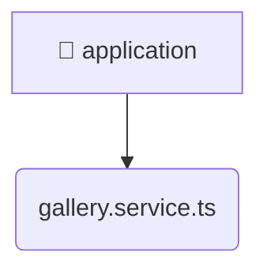

# [root](/) / [backend](/backend) / [src](/backend/src) / [modules](/backend/src/modules) / [gallery](/backend/src/modules/gallery) / [application](/backend/src/modules/gallery/application)

## 🏷️ 📁 Application

### 🎯 PURPOSE
The `application` directory forms a critical foundation within the Mavluda Beauty ecosystem, meticulously orchestrating the application logic to ensure a seamless and premium experience.

### 🏗️ ARCHITECTURE


### 📄 FILE REGISTRY
| File Name | Type | Responsibility | Key Aliases Used |
|---|---|---|---|
| `gallery.service.ts` | `ts` | Business logic and service layer. | @nestjs |

### 🔗 DEPENDENCIES
- `../domain/gallery.entity`
- `../infrastructure/repositories/gallery.repository`
- `@nestjs/common`

### 🛠️ USAGE
```typescript
// Seamlessly integrate application into your refined workflows:
import { /* exported members */ } from '@path/to/application';
```
