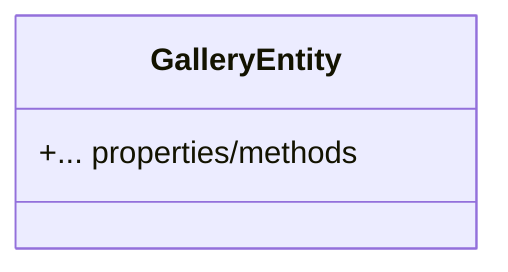
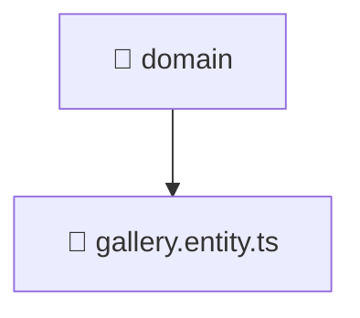

# 🧠 Domain Directory

[backend](/backend) > [src](/backend/src) > [modules](/backend/src/modules) > [gallery](/backend/src/modules/gallery) > [domain](/backend/src/modules/gallery/domain)

## 🎯 Purpose
A high-level module handling `domain` logic within the Mavluda Beauty ecosystem. This directory adheres to our "Luxury Professional" architectural standards.


## 🏗️ Architecture



## 📄 File Registry
| File Name | Type | Responsibility | Key Aliases Used |
|-----------|------|----------------|------------------|
| `gallery.entity.ts` | TypeScript | Provides localized typescript definitions. | None |

## 🔗 Dependencies
- No major internal/external path aliases detected.

## 🛠️ Usage
```typescript
// Architectural overview snippet
import { InternalLogic } from './internal-file';
// Ensure adherence to Hexagonal / FSD principles
```

## 📝 Existing Context
# 📁 domain

[Root](/.) > [backend](/backend) > [src](/backend/src) > [modules](/backend/src/modules) > [gallery](/backend/src/modules/gallery) > [domain](/backend/src/modules/gallery/domain)

## 🎯 Purpose
Delivering luxury-tier architectural components and high-performance logic for the **domain** domain. This directory is a crucial part of the Mavluda Beauty full-stack ecosystem, ensuring seamless scalability, robust performance, and an elite digital experience.

## 🏗️ Architecture


## 📄 File Registry
| File Name | Type | Responsibility | Key Aliases Used |
|---|---|---|---|
| `gallery.entity.ts` | TypeScript | Provides core logic and orchestration for gallery.entity.ts. | N/A |

## 🔗 Dependencies
- No external dependencies.

## 🛠️ Usage
```typescript
// Example usage within the Mavluda Beauty ecosystem
import { relevantMember } from './domain';

// Integrate into the application architecture
relevantMember.execute();
```
