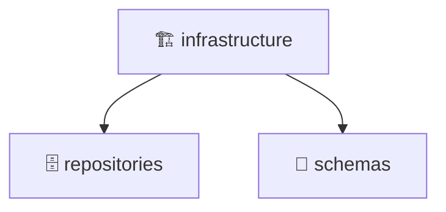

# [backend](/backend) / [src](/backend/src) / [modules](/backend/src/modules) / [gallery](/backend/src/modules/gallery) / [infrastructure](/backend/src/modules/gallery/infrastructure)

## 🏷️ 🏗️ Infrastructure

### 🎯 PURPOSE
The `infrastructure` directory forms a critical foundation within the Mavluda Beauty ecosystem, meticulously orchestrating the infrastructure logic to ensure a seamless and premium experience. Rooted in the NestJS backend architecture, it delivers robust, high-performance operations tailored for high-end beauty and wedding services.

### 🏗️ ARCHITECTURE


### 📄 FILE REGISTRY
| File Name | Type | Responsibility | Key Aliases Used |
|---|---|---|---|
| *No exclusive files* | - | Architecturally reserved | - |


### 🔗 DEPENDENCIES
- *Self-contained premium module.*

### 🛠️ USAGE
```typescript
// Seamlessly integrate infrastructure into your refined workflows:
import { /* exported members */ } from '@path/to/infrastructure';
```
