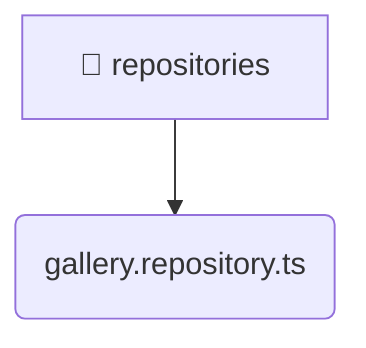

# [root](/) / [backend](/backend) / [src](/backend/src) / [modules](/backend/src/modules) / [gallery](/backend/src/modules/gallery) / [infrastructure](/backend/src/modules/gallery/infrastructure) / [repositories](/backend/src/modules/gallery/infrastructure/repositories)

## 🏷️ 📁 Repositories

### 🎯 PURPOSE
The `repositories` directory forms a critical foundation within the Mavluda Beauty ecosystem, meticulously orchestrating the repositories logic to ensure a seamless and premium experience.

### 🏗️ ARCHITECTURE


### 📄 FILE REGISTRY
| File Name | Type | Responsibility | Key Aliases Used |
|---|---|---|---|
| `gallery.repository.ts` | `ts` | Core logic implementation. | @nestjs |

### 🔗 DEPENDENCIES
- `../../domain/gallery.entity`
- `../schemas/gallery.schema`
- `@nestjs/common`
- `@nestjs/mongoose`
- `mongoose`

### 🛠️ USAGE
```typescript
// Seamlessly integrate repositories into your refined workflows:
import { /* exported members */ } from '@path/to/repositories';
```
