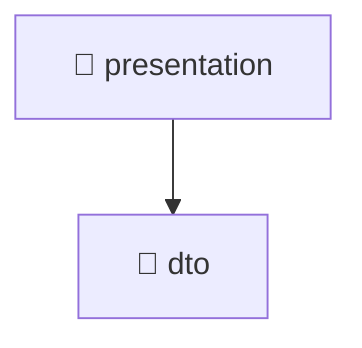

# 📁 presentation

[Root](/.) > [backend](/backend) > [src](/backend/src) > [modules](/backend/src/modules) > [gallery](/backend/src/modules/gallery) > [presentation](/backend/src/modules/gallery/presentation)

## 🎯 Purpose
Delivering luxury-tier architectural components and high-performance logic for the **presentation** domain. This directory is a crucial part of the Mavluda Beauty full-stack ecosystem, ensuring seamless scalability, robust performance, and an elite digital experience.
> **FSD Layer:** Modules (Backend FSD) - Adhering to strict Feature Sliced Design architectural constraints.

## 🏗️ Architecture


## 📄 File Registry
| File Name | Type | Responsibility | Key Aliases Used |
|---|---|---|---|
| `gallery.controller.ts` | Controller | Request handling and routing. | @nestjs |


## 🔗 Dependencies
- `@nestjs/common`
- `@nestjs/platform-express`
- `multer`
- `path`
- `../application/gallery.service`
- `../domain/gallery.entity`
- `./dto/create-gallery.dto`
- `./dto/update-gallery.dto`

## 🛠️ Usage
```typescript
// Example usage within the Mavluda Beauty ecosystem
import { relevantMember } from './gallery.controller';

// Integrate into the application architecture
relevantMember.execute();
```
