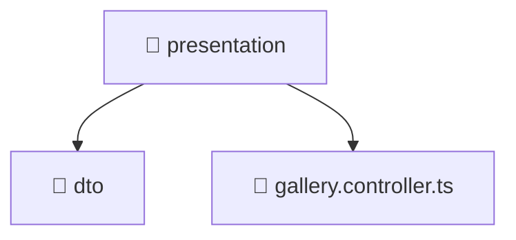

# 📁 presentation

[Root](/.) > [backend](/backend) > [src](/backend/src) > [modules](/backend/src/modules) > [gallery](/backend/src/modules/gallery) > [presentation](/backend/src/modules/gallery/presentation)

## 🎯 Purpose
Backend module defining application routes, business logic, and data access for the domain.

## 🏗️ Architecture


## 📄 File Registry
| File Name | Type | Responsibility | Key Aliases Used |
|---|---|---|---|
| `gallery.controller.ts` | TypeScript | Handles incoming HTTP requests and routing for gallery.controller.ts. | @nestjs |

## 🔗 Dependencies
- `../application/gallery.service`
- `../domain/gallery.entity`
- `./dto/create-gallery.dto`
- `./dto/update-gallery.dto`
- `@nestjs/platform-express`
- `multer`
- `path`

## 🛠️ Usage
```typescript
import { Module } from '@nestjs/common';
// Import specific services/controllers provided by this module
```
