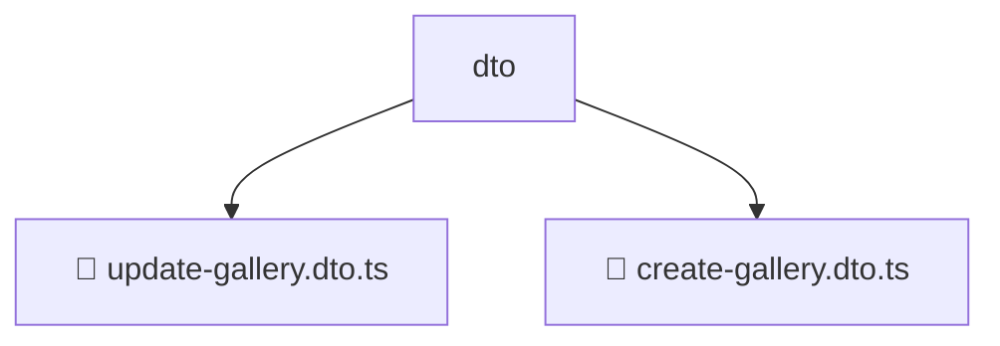

# 📂 DTO

> 💎 **Mavluda Beauty - Luxury Professional Architecture**

### 📍 Breadcrumb Navigation
`. > backend > src > modules > gallery > presentation > dto`

## 🎯 PURPOSE
This directory encapsulates `Presentation` level functionality within the Mavluda Beauty ecosystem, ensuring proper separation of concerns and architectural transparency.

**FSD / Architecture Layer:** `Presentation`

## 🏗️ ARCHITECTURE


## 📄 FILE REGISTRY

| Item Name | Type | Responsibility | Key Aliases Used |
|-----------|------|----------------|------------------|
| `📄 update-gallery.dto.ts` | `.ts` | DTO definitions | `@nestjs/mapped-types` |
| `📄 create-gallery.dto.ts` | `.ts` | DTO definitions | `None` |

## 🔗 DEPENDENCIES
- `@nestjs/mapped-types`

## 🛠️ USAGE
```typescript
// Example usage context
import { ... } from './update-gallery.dto';

// Integrate update-gallery.dto logic into your feature.
```
