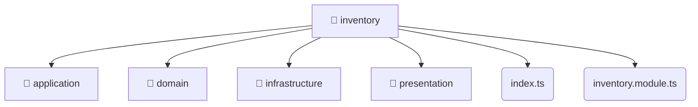

# [root](/) / [backend](/backend) / [src](/backend/src) / [modules](/backend/src/modules) / [inventory](/backend/src/modules/inventory)

## 🏷️ 📁 Inventory

### 🎯 PURPOSE
The `inventory` backend module encapsulates the business logic, presentation, and data access for inventory.

### 🏗️ ARCHITECTURE


### 📄 FILE REGISTRY
| File Name | Type | Responsibility | Key Aliases Used |
|---|---|---|---|
| `index.ts` | `ts` | Core logic implementation. | None |
| `inventory.module.ts` | `ts` | Module configuration and provider registration. | @nestjs |

### 🔗 DEPENDENCIES
- `./application/inventory.service`
- `./domain/inventory.entity`
- `./infrastructure/repositories/inventory.repository`
- `./infrastructure/schemas/inventory.schema`
- `./inventory.module`
- `./presentation/dto/create-inventory.dto`
- `./presentation/dto/update-inventory.dto`
- `./presentation/inventory.controller`
- `@nestjs/common`
- `@nestjs/mongoose`

### 🛠️ USAGE
```typescript
// Seamlessly integrate inventory into your refined workflows:
import { /* exported members */ } from '@path/to/inventory';
```
