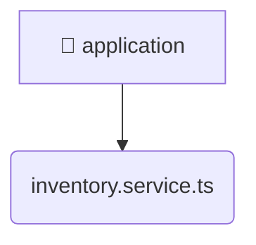

# [backend](/backend) / [src](/backend/src) / [modules](/backend/src/modules) / [inventory](/backend/src/modules/inventory) / [application](/backend/src/modules/inventory/application)

## 🏷️ 🚀 Application

### 🎯 PURPOSE
The `application` directory forms a critical foundation within the Mavluda Beauty ecosystem, meticulously orchestrating the application logic to ensure a seamless and premium experience. Rooted in the NestJS backend architecture, it delivers robust, high-performance operations tailored for high-end beauty and wedding services.

### 🏗️ ARCHITECTURE


### 📄 FILE REGISTRY
| File Name | Type | Responsibility | Key Aliases Used |
|---|---|---|---|
| `inventory.service.ts` | `ts` | Encapsulates premium logic and definitions for `inventory.service.ts`. | @nestjs/common |


### 🔗 DEPENDENCIES
- `@nestjs/common`

### 🛠️ USAGE
```typescript
// Seamlessly integrate application into your refined workflows:
import { /* exported members */ } from '@path/to/application';
```
