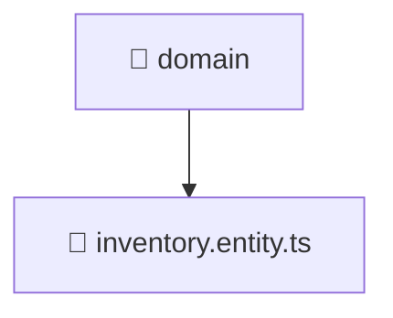

<!--
Mavluda Beauty - Luxury Professional Documentation
Generated for 100% Architectural Transparency
-->
[Home](../../../../../README.md) > [backend](../../../../README.md) > [src](../../../README.md) > [modules](../../README.md) > [inventory](../README.md) > [domain](./README.md)

# 📁 DOMAIN Directory

## 🎯 PURPOSE
Defines the core business entities, interfaces, and domain logic without external dependencies, adhering to DDD principles.

## 🏗️ ARCHITECTURE


## 📄 FILE REGISTRY
| File Name | Type | Responsibility | Key Aliases Used |
|---|---|---|---|
| `inventory.entity.ts` | TypeScript | Core logic implementation. | - |


## 🔗 DEPENDENCIES
- No external or internal imports detected in this directory.

## 🛠️ USAGE
```typescript
// Example placeholder for interacting with domain
// Consult the individual files in the registry for specific APIs.
```
