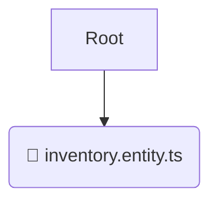

# 🎯 domain

*Breadcrumbs:* [backend](/backend) / [src](/backend/src) / [modules](/backend/src/modules) / [inventory](/backend/src/modules/inventory) / [domain](/backend/src/modules/inventory/domain)

## 🎯 PURPOSE
This directory `domain` is an integral part of the Mavluda Beauty ecosystem. It encapsulates the core business logic, entities, and domain rules.
This directory is meticulously maintained to uphold the 'Luxury Professional' standards of the Mavluda Beauty brand.

## 🏗️ ARCHITECTURE


## 📄 FILE REGISTRY
| File Name | Type | Responsibility | Key Aliases Used |
|---|---|---|---|
| `inventory.entity.ts` | `ts` | Core functionality | `None` |

## 🔗 DEPENDENCIES
- No significant internal/external dependencies found.

## 🛠️ USAGE
```typescript
// Example placeholder for interacting with the domain module
import { example } from './inventory.entity.ts';
```
