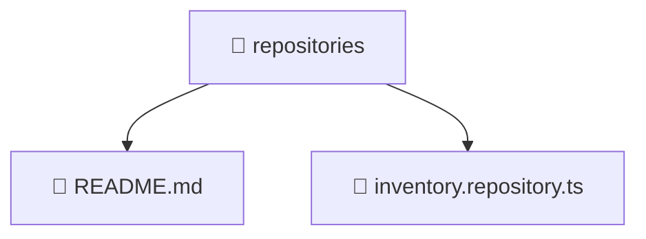

# 📁 repositories

[Root](/.) > [backend](/backend) > [src](/backend/src) > [modules](/backend/src/modules) > [inventory](/backend/src/modules/inventory) > [infrastructure](/backend/src/modules/inventory/infrastructure) > [repositories](/backend/src/modules/inventory/infrastructure/repositories)

## 🎯 Purpose
Delivering luxury-tier architectural components and high-performance logic for the **repositories** domain. This directory is a crucial part of the Mavluda Beauty full-stack ecosystem, ensuring seamless scalability, robust performance, and an elite digital experience.

## 🏗️ Architecture


## 📄 File Registry
| File Name | Type | Responsibility | Key Aliases Used |
|---|---|---|---|
| `README.md` | Markdown | Provides core logic and configuration for README.md. | N/A |
| `inventory.repository.ts` | TypeScript | Provides core logic and orchestration for inventory.repository.ts. | @nestjs |

## 🔗 Dependencies
- `../../domain/inventory.entity`
- `../schemas/inventory.schema`
- `./repositories`
- `@nestjs/common`
- `@nestjs/mongoose`
- `mongoose`

## 🛠️ Usage
```typescript
// Example usage within the Mavluda Beauty ecosystem
import { relevantMember } from './repositories';

// Integrate into the application architecture
relevantMember.execute();
```
