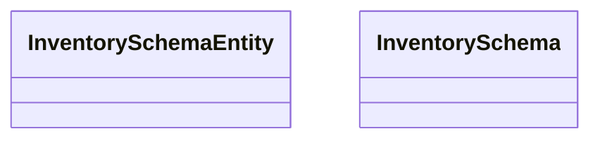

# 📁 Schemas Directory

[Root](/.) / [backend](/backend) / [src](/backend/src) / [modules](/backend/src/modules) / [inventory](/backend/src/modules/inventory) / [infrastructure](/backend/src/modules/inventory/infrastructure) / [schemas](/backend/src/modules/inventory/infrastructure/schemas)

## 🎯 Purpose
Delivering luxury-tier architectural components and high-performance logic for the **schemas** domain. This directory is a crucial part of the Mavluda Beauty full-stack ecosystem, ensuring seamless scalability, robust performance, and an elite digital experience.

## 🏗️ Architecture


## 📄 File Registry
| File Name | Type | Responsibility | Key Aliases Used |
|---|---|---|---|
| `inventory.schema.ts` | File | Provides core logic and orchestration for inventory.schema.ts. | @nestjs/mongoose |

## 🔗 Dependencies
- Relies on internal Mavluda Beauty architecture and designated FSD layers.
- See 'Key Aliases Used' in the File Registry for explicit cross-domain references.

## 🛠️ Usage
```typescript
// Example usage within the Mavluda Beauty ecosystem
import { relevantMember } from './core';

// Integrate into the application architecture
relevantMember.execute();
```
