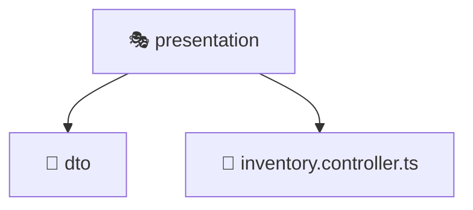

# 🎭 Mavluda Beauty presentation

[backend](/backend) / [src](/backend/src) / [modules](/backend/src/modules) / [inventory](/backend/src/modules/inventory) / [presentation](/backend/src/modules/inventory/presentation)

## 🎯 Purpose
Delivering luxury-tier architectural components and high-performance logic for the **presentation** domain. This directory is a crucial part of the Mavluda Beauty full-stack ecosystem, ensuring seamless scalability, robust performance, and an elite digital experience.

## 🏗️ Architecture


## 📄 File Registry
| File Name | Type | Responsibility | Key Aliases Used |
|---|---|---|---|
| `inventory.controller.ts` | Controller | Handles HTTP requests and orchestrates responses. | `@nestjs/common` |


## 🔗 Dependencies
**Path Aliases:**
- `@nestjs/common`


## 🛠️ Usage
```typescript
// Example integration for presentation
// Import capabilities from this directory to enrich your modules.
```
> This directory provides specialized logic tailored to the Mavluda Beauty standard.
