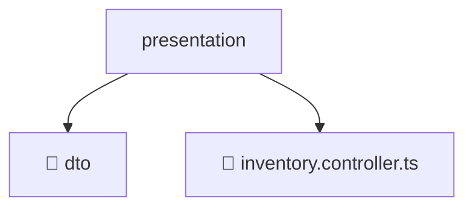

# 📂 PRESENTATION

> 💎 **Mavluda Beauty - Luxury Professional Architecture**

### 📍 Breadcrumb Navigation
`. > backend > src > modules > inventory > presentation`

## 🎯 PURPOSE
This directory encapsulates `Presentation` level functionality within the Mavluda Beauty ecosystem, ensuring proper separation of concerns and architectural transparency.

**FSD / Architecture Layer:** `Presentation`

## 🏗️ ARCHITECTURE


## 📄 FILE REGISTRY

| Item Name | Type | Responsibility | Key Aliases Used |
|-----------|------|----------------|------------------|
| `📁 dto` | `Directory` | Subdirectory logic grouping | `None` |
| `📄 inventory.controller.ts` | `.ts` | Controller logic | `@nestjs/common` |

## 🔗 DEPENDENCIES
- `@nestjs/common`

## 🛠️ USAGE
```typescript
// Example usage context
import { ... } from './inventory.controller';

// Integrate inventory.controller logic into your feature.
```
