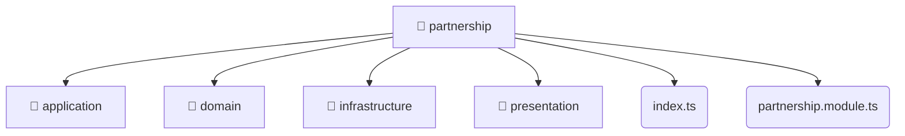

# [root](/) / [backend](/backend) / [src](/backend/src) / [modules](/backend/src/modules) / [partnership](/backend/src/modules/partnership)

## 🏷️ 📁 Partnership

### 🎯 PURPOSE
The `partnership` directory forms a critical foundation within the Mavluda Beauty ecosystem, meticulously orchestrating the partnership logic to ensure a seamless and premium experience.

### 🏗️ ARCHITECTURE


### 📄 FILE REGISTRY
| File Name | Type | Responsibility | Key Aliases Used |
|---|---|---|---|
| `index.ts` | `ts` | Core logic implementation. | None |
| `partnership.module.ts` | `ts` | Module configuration and provider registration. | @nestjs |

### 🔗 DEPENDENCIES
- `./application/partnership.service`
- `./domain/partnership.entity`
- `./infrastructure/repositories/partnership.repository`
- `./infrastructure/schemas/partnership.schema`
- `./partnership.module`
- `./presentation/dto/create-partnership.dto`
- `./presentation/dto/update-partnership.dto`
- `./presentation/partnership.controller`
- `@nestjs/common`
- `@nestjs/mongoose`

### 🛠️ USAGE
```typescript
// Seamlessly integrate partnership into your refined workflows:
import { /* exported members */ } from '@path/to/partnership';
```
