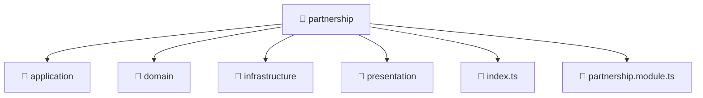

<!--
Mavluda Beauty - Luxury Professional Documentation
Generated for 100% Architectural Transparency
-->
[Home](../../../../README.md) > [backend](../../../README.md) > [src](../../README.md) > [modules](../README.md) > [partnership](./README.md)

# 📁 PARTNERSHIP Directory

## 🎯 PURPOSE
Manages the partnership module, providing robust and secure backend services for the Mavluda Beauty application.

## 🏗️ ARCHITECTURE


## 📄 FILE REGISTRY
| File Name | Type | Responsibility | Key Aliases Used |
|---|---|---|---|
| `index.ts` | TypeScript | Core logic implementation. | - |
| `partnership.module.ts` | TypeScript | Module configuration and dependency injection. | @nestjs |


## 🔗 DEPENDENCIES
- `@nestjs/common`
- `@nestjs/mongoose`
- `./application/partnership.service`
- `./presentation/partnership.controller`
- `./infrastructure/repositories/partnership.repository`

## 🛠️ USAGE
```typescript
// Example placeholder for interacting with partnership
// Consult the individual files in the registry for specific APIs.
```
