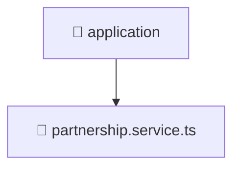

<!--
Mavluda Beauty - Luxury Professional Documentation
Generated for 100% Architectural Transparency
-->
[Home](../../../../../README.md) > [backend](../../../../README.md) > [src](../../../README.md) > [modules](../../README.md) > [partnership](../README.md) > [application](./README.md)

# 📁 APPLICATION Directory

> **FSD Layer:** App

## 🎯 PURPOSE
Contains the application use cases and business logic orchestrations.

## 🏗️ ARCHITECTURE


## 📄 FILE REGISTRY
| File Name | Type | Responsibility | Key Aliases Used |
|---|---|---|---|
| `partnership.service.ts` | TypeScript | Business logic and service orchestration. | @nestjs |


## 🔗 DEPENDENCIES
- `@nestjs/common`
- `../domain/partnership.entity`
- `../infrastructure/repositories/partnership.repository`
- `../presentation/dto/create-partnership.dto`
- `../presentation/dto/update-partnership.dto`

## 🛠️ USAGE
```typescript
// Example placeholder for interacting with application
// Consult the individual files in the registry for specific APIs.
```
