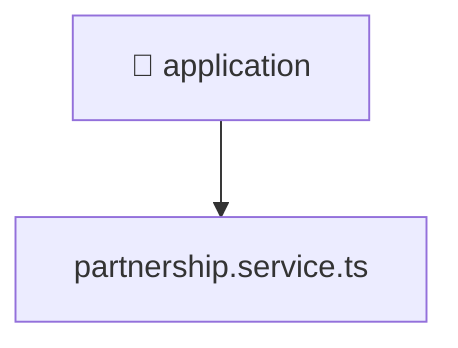

[🏠 Home](../../../../../README.md) > [backend](../../../../README.md) > [src](../../../README.md) > [modules](../../README.md) > [partnership](../README.md) > [application](./README.md)

# 📁 application

### 🎯 PURPOSE
Welcome to the exquisite **application** module of the Mavluda Beauty ecosystem. This directory focuses on orchestrating Business Services. It is designed adhering to our 'Luxury Professional' standards.

### 🏗️ ARCHITECTURE


### 📄 FILE REGISTRY
| File Name | Type | Responsibility | Key Aliases Used |
|---|---|---|---|
| `partnership.service.ts` | Angular Service | Provides injectable business logic or services Defines classes: PartnershipService. | @nestjs |

### 🔗 DEPENDENCIES
- `@nestjs/common`

### 🛠️ USAGE
```typescript
// Example interaction or integration snippet
// Import members from application based on module boundaries
```
