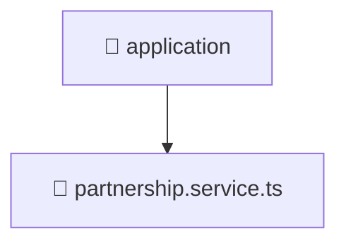

# 📁 application

[Root](/.) > [backend](/backend) > [src](/backend/src) > [modules](/backend/src/modules) > [partnership](/backend/src/modules/partnership) > [application](/backend/src/modules/partnership/application)

## 🎯 Purpose
Delivering luxury-tier architectural components and high-performance logic for the **application** domain. This directory is a crucial part of the Mavluda Beauty full-stack ecosystem, ensuring seamless scalability, robust performance, and an elite digital experience.
> **FSD Layer:** Modules (Backend FSD) - Adhering to strict Feature Sliced Design architectural constraints.

## 🏗️ Architecture


## 📄 File Registry
| File Name | Type | Responsibility | Key Aliases Used |
|---|---|---|---|
| `partnership.service.ts` | Service | Business logic and state management. | @nestjs |


## 🔗 Dependencies
- `@nestjs/common`
- `../domain/partnership.entity`
- `../infrastructure/repositories/partnership.repository`
- `../presentation/dto/create-partnership.dto`
- `../presentation/dto/update-partnership.dto`

## 🛠️ Usage
```typescript
// Example usage within the Mavluda Beauty ecosystem
import { relevantMember } from './partnership.service';

// Integrate into the application architecture
relevantMember.execute();
```
