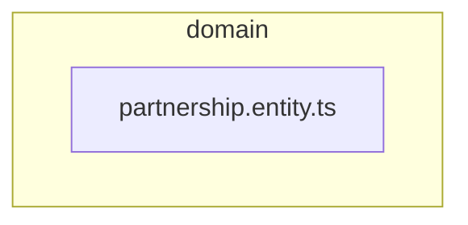

# 🧠 domain

[backend](../../../../README.md) > [src](../../../README.md) > [modules](../../README.md) > [partnership](../README.md) > [domain](README.md)

---

### 🎯 PURPOSE
Elevating the digital experience for the Mavluda Beauty ecosystem, this module manages the sophisticated Domain Layer (Enterprise business rules) operations.

*FSD Layer:* **Domain Layer (Enterprise business rules)**

---

### 🏗️ ARCHITECTURE



---

### 📄 FILE REGISTRY
| File Name | Type | Responsibility | Key Aliases Used |
|-----------|------|----------------|------------------|
| `partnership.entity.ts` | Source | Handles source logic for Mavluda Beauty's luxury standards. | `None` |

---

### 🔗 DEPENDENCIES
No external or internal dependencies detected.

---

### 🛠️ USAGE
To interact with this directory's luxurious logic, integrate its exported components or services directly into your feature modules. Ensure strict adherence to the Domain Layer (Enterprise business rules) boundaries.

```typescript
// Example integration snippet
import { FeatureModule } from '@path/to/domain';
```
