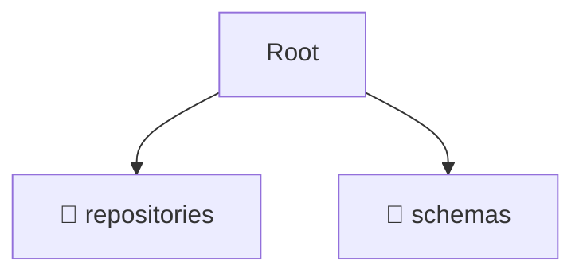

# 🏢 infrastructure

*Breadcrumbs:* [backend](/backend) / [src](/backend/src) / [modules](/backend/src/modules) / [partnership](/backend/src/modules/partnership) / [infrastructure](/backend/src/modules/partnership/infrastructure)

## 🎯 PURPOSE
This directory `infrastructure` is an integral part of the Mavluda Beauty ecosystem. It handles external integrations, databases, and low-level infrastructural concerns.
This directory is meticulously maintained to uphold the 'Luxury Professional' standards of the Mavluda Beauty brand.

## 🏗️ ARCHITECTURE


## 📄 FILE REGISTRY
| File Name | Type | Responsibility | Key Aliases Used |
|---|---|---|---|

## 🔗 DEPENDENCIES
- No significant internal/external dependencies found.

## 🛠️ USAGE
```typescript
// Example placeholder for interacting with the infrastructure module
import { example } from './example';
```
