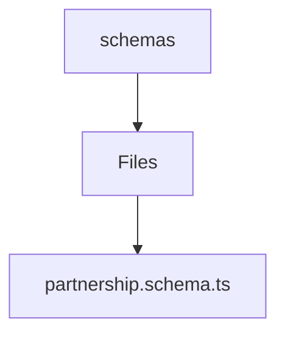

# 🏷️ Schemas Directory

> *Elegance, Precision, and Luxury Professionalism — The Mavluda Beauty Standard.*

## 🧭 Breadcrumb Navigation
[backend](/backend) ➔ [src](/backend/src) ➔ [modules](/backend/src/modules) ➔ [partnership](/backend/src/modules/partnership) ➔ [infrastructure](/backend/src/modules/partnership/infrastructure) ➔ [schemas](/backend/src/modules/partnership/infrastructure/schemas)

## 🎯 Purpose
This directory encapsulates the essential architecture and logic for the **Schemas** domain within the Mavluda Beauty ecosystem. It serves as a foundational component ensuring robust, scalable, and elegant operations.

## 🏗️ Architecture


## 📄 File Registry
| File Name | Type | Responsibility | Key Aliases Used |
|---|---|---|---|
| `partnership.schema.ts` | TypeScript | Exports: PartnershipDocument, PartnershipSchemaEntity, PartnershipSchema | None |

## 🔗 Dependencies
- `@nestjs/mongoose`
- `mongoose`

## 🛠️ Usage
```typescript
// To utilize the luxurious capabilities of this module:
import { PartnershipDocument } from './path/to/partnershipdocument';

// Ensure properly typed interactions per Mavluda Beauty standards
```
