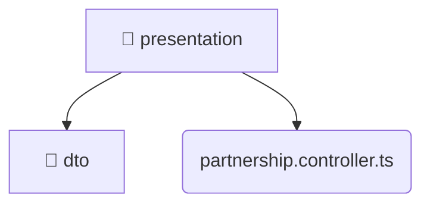

# [root](/) / [backend](/backend) / [src](/backend/src) / [modules](/backend/src/modules) / [partnership](/backend/src/modules/partnership) / [presentation](/backend/src/modules/partnership/presentation)

## 🏷️ 📁 Presentation

### 🎯 PURPOSE
The `presentation` directory forms a critical foundation within the Mavluda Beauty ecosystem, meticulously orchestrating the presentation logic to ensure a seamless and premium experience.

### 🏗️ ARCHITECTURE


### 📄 FILE REGISTRY
| File Name | Type | Responsibility | Key Aliases Used |
|---|---|---|---|
| `partnership.controller.ts` | `ts` | Handles incoming HTTP requests. | @nestjs |

### 🔗 DEPENDENCIES
- `../application/partnership.service`
- `./dto/create-partnership.dto`
- `./dto/update-partnership.dto`
- `@nestjs/common`

### 🛠️ USAGE
```typescript
// Seamlessly integrate presentation into your refined workflows:
import { /* exported members */ } from '@path/to/presentation';
```
