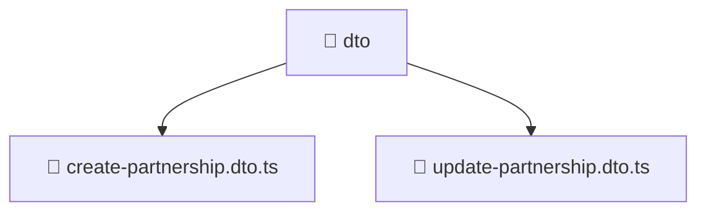

# 📁 dto

[Root](/.) > [backend](/backend) > [src](/backend/src) > [modules](/backend/src/modules) > [partnership](/backend/src/modules/partnership) > [presentation](/backend/src/modules/partnership/presentation) > [dto](/backend/src/modules/partnership/presentation/dto)

## 🎯 Purpose
Delivering luxury-tier architectural components and high-performance logic for the **Dto** domain. This directory is a crucial part of the Mavluda Beauty full-stack ecosystem, ensuring seamless scalability, robust performance, and an elite digital experience.

**Architecture Layer:** Backend Infrastructure (Feature Sliced Design / Layered Architecture)

## 🏗️ Architecture


## 📄 File Registry
| File Name | Type | Responsibility | Key Aliases Used |
|---|---|---|---|
| `create-partnership.dto.ts` | TypeScript | Core logic and utilities for this domain. | N/A |
| `update-partnership.dto.ts` | TypeScript | Core logic and utilities for this domain. | @nestjs |

## 🔗 Dependencies
- `./create-partnership.dto`
- `@nestjs/mapped-types`

## 🛠️ Usage
```markdown
```markdown
> This directory acts primarily as a structural container or logic module.
> To interact with its contents, import the relevant exported members from the `index.ts` or specifically targeted files.
```
```
