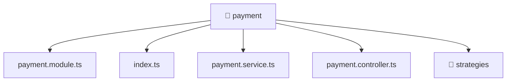

[🏠 Home](../../../../README.md) > [backend](../../../README.md) > [src](../../README.md) > [modules](../README.md) > [payment](./README.md)

# 📁 payment

### 🎯 PURPOSE
Welcome to the exquisite **payment** module of the Mavluda Beauty ecosystem. This directory focuses on orchestrating Business Services, HTTP APIs. It is designed adhering to our 'Luxury Professional' standards.

### 🏗️ ARCHITECTURE


### 📄 FILE REGISTRY
| File Name | Type | Responsibility | Key Aliases Used |
|---|---|---|---|
| `index.ts` | TypeScript File | Exports or orchestrates module members. | None |
| `payment.controller.ts` | NestJS Controller | Handles incoming HTTP requests Defines classes: PaymentController. | None |
| `payment.module.ts` | Angular Module | Configures an application module or layer Defines classes: PaymentModule. | @nestjs |
| `payment.service.ts` | Angular Service | Provides injectable business logic or services Defines classes: PaymentService. | @nestjs |

### 🔗 DEPENDENCIES
- `@nestjs/common`

### 🛠️ USAGE
```typescript
// Example interaction or integration snippet
// Import members from payment based on module boundaries
```
